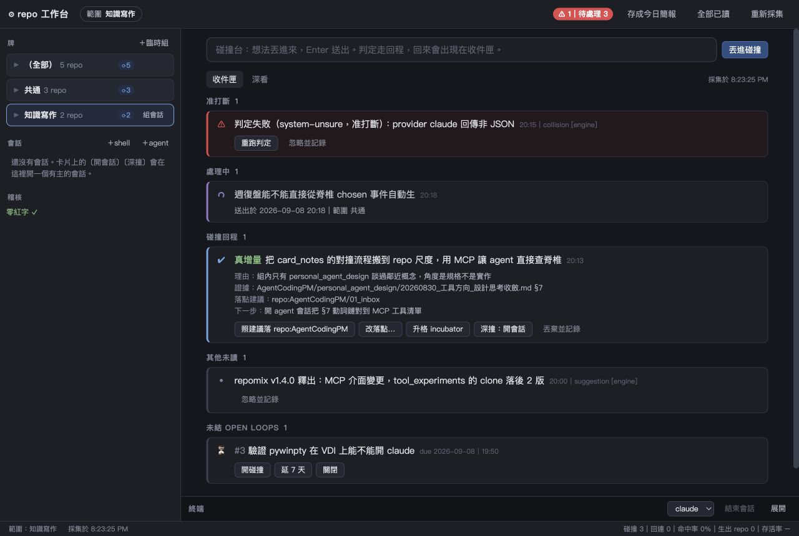
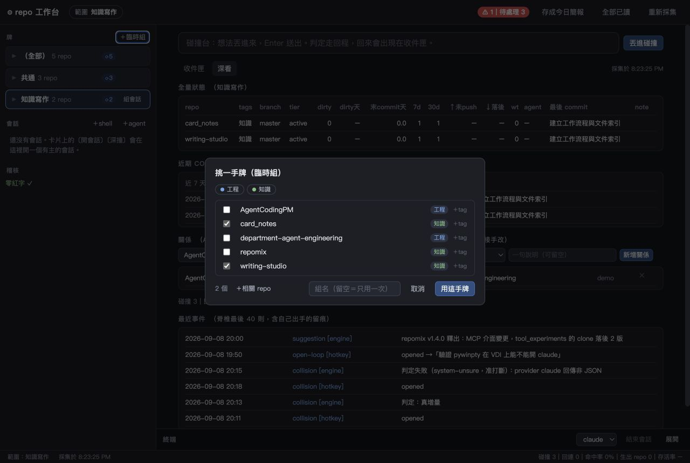
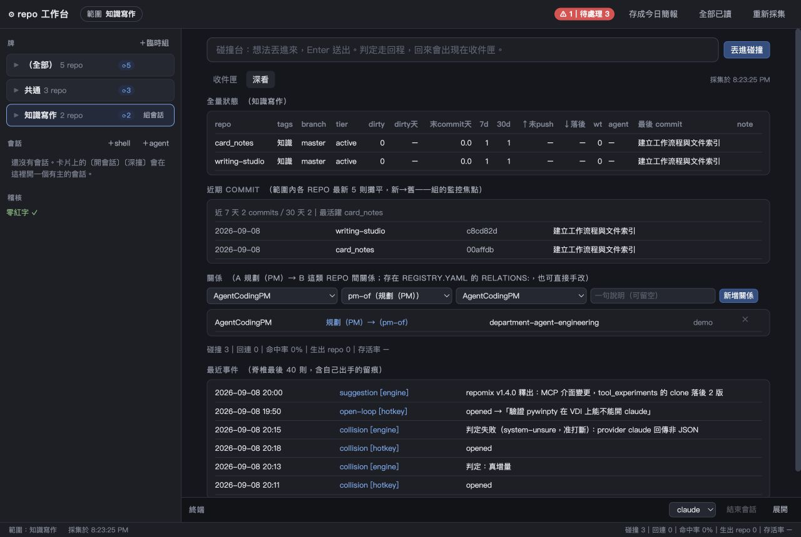

# 工作台 UI/UX 成熟度檢討

日期：2026-09-08。檢視版本：`dad40f5`。範圍：本 repo，R0 檢視與文件產出。

> **落地狀態（同日）**：§5 第一輪＋第二輪已落地（146 tests 全綠、Chrome 1280×860 走查）；第三輪與人工驗收未做。
> 對應內容與證據見 `20260908_工作台UI_UX成熟度檢討_落地記錄.md`。本檔維持檢討當時的原樣不改。

**設計判斷：已有可用工作台的骨架，視覺與互動仍帶有工程原型感。成熟感的主要缺口是工作焦點、資訊取捨與狀態可信度。**

本次以資深產品設計師的啟發式檢視為主，對照原始碼與瀏覽器操作。使用獨立暫存 spine、5 個示範 repo、2 組及既有 `seed_demo` 事件；畫面中的事件與 repo 活動皆為示範，不能當作真實營運結果。查看一般寬視窗與原生 app 預設的 1280×860 尺寸。沒有修改產品程式、執行真 Agent 任務或操作使用者的正式 spine；未驗證 Windows/VDI 原生視窗、螢幕閱讀器與長時間使用。

## 1. 保留的設計基礎

- 牌組作為工作範圍，搭配收件匣、會話與終端，符合工具的核心工作方式。
- 收件卡已有真正行動按鈕、處理中狀態、來源與判定證據，優於上一輪記錄的純展示出口。
- 暗色底、有限的狀態色與無會話時收合終端，方向合理。
- 收件卡已有 key-based 更新；後續應延伸到其他互動區域。

20260902 檢討列出的修正已有落地；本次評估的是這個版本還缺什麼，不重複把已修正問題當成現況。

## 2. 第一眼為何仍不像成熟工具

畫面缺少明確的工作標題與任務摘要。主要視覺入口是長 placeholder，接著是相近大小的分類標籤、卡片與按鈕。使用者要自行推斷「這是哪一組的工作」「現在最值得處理什麼」。

在 1280×860，五張示範卡已接近主內容高度上限；每張卡又帶完整段落及多個出口。在較寬畫面，900px 主欄置中，與左側導覽之間出現明顯空隙。留白本身合理，但目前沒有用來建立清楚的工作區域。

字級大量落在 11–13px，標題只有 14.5px；來源、時間、說明又降到很暗的灰色。整體雖整齊，閱讀時仍需要靠近看、逐字找。這是長時間使用工具的阻力。

## 3. 優先改善項目

以下 P0/P1/P2 僅表示本次改善順序，不是任務風險或成熟度等級。實作時仍依 R0–R3 另行分類。

### P0-1：範圍的畫面承諾與實際內容不一致

**已實際重現。** 點選「知識寫作」後，頂端與底部都顯示這個範圍，但收件匣仍出現「範圍 共通」的處理中任務及 repomix 事件。深看的狀態表已切組，關係和最近事件仍是全域。

程式證據：`workbench.html:504` 的 `allCards()` 只過濾 `scan.question_cards`，直接串接全部 `state.cards`；`webui.py:221` 的 `build_state()` 回傳全域事件卡。`webui.py:298` 的全部已讀也沒有範圍參數。

**建議：** 每個主要區域採用一致的範圍契約。組內待辦、活動與結果依目前組過濾；需要跨組顯示的警示獨立標「全域警示」，每則事件提供所屬組／repo。無法判定歸屬的項目標成「未分類」，避免默默歸到目前組。全部已讀明確命名為「本組全部標為已讀」或「所有組全部標為已讀」，並讓影響數量可見。

**驗收：** 在兩組各建立事件，切組後內容、計數及批次操作影響範圍一致；全域例外始終有可見標示。

### P0-2：失敗、等待與恢復狀態不完整

**原始碼確認；尚未做網路故障注入。** `submitIdea()` 在 API 成功前清空輸入；Enter 處理沒有檢查 `isComposing`，中文輸入法選字時的行為需要實測。`refreshState()`／`rescan()` 吞掉例外；連線錯誤未必有持續可見的訊息。一般行動沒有執行中的按鈕鎖定。

空卡片列表直接顯示「一切正常」，未區分首次載入、尚未登記 repo、讀取失敗及真正沒有待辦。頁尾「無異常、無變化」由卡片 repo 數推算，並沒有使用已取得的 `scan.quiet`，因此文案強度超過計算依據。

**建議：** 送出成功後才清草稿；失敗在輸入旁保留原因和重試。更新中、上次成功更新與連線中斷採持續狀態列。空狀態分成「尚未載入」「尚未設定」「沒有待處理事項」「無法更新」；健康判斷需要採集成功作為前提。動作執行時防重複點擊，完成後提供可追查的結果入口。

**驗收：** 斷線送出不丟字；失敗不顯示健康；中文選字 Enter 不誤送；快速連點不重複建立任務。

### P1-1：卡片資訊與動作缺少主次

**畫面確認。** 碰撞結果一次展開理由、證據、落點、下一步，加上五個動作；除了忽略較淡，其餘大致同權重。系統已給建議，介面仍要求使用者重新閱讀所有選項。

**建議：** 列表先顯示「任務標題＋一句結果＋來源／時間」，選取後才展開完整證據。每張卡以一個主要動作、一個次要動作與更多選單呈現。例如主要「存入 AgentCodingPM」、次要「與 Agent 深入討論」，改位置、移入孵化區與捨棄收進更多。主要動作應由卡片狀態及確定的目的地決定，不能把陣列第一項一律塗藍。

處理中任務可保留獨立小區塊；需要使用者決策的事項應優先占據閱讀空間。來源文件應能開啟或至少複製完整位置。

**驗收：** 使用者能在不展開全文下理解結果與下一步；十筆以上事件仍能有效掃讀，完整證據隨時可取用。

### P1-2：缺少足夠明確的視覺層級與閱讀對比

**畫面與 CSS 確認。** `--f3:17px` 未被用來建立頁面標題。時間／來源採 `#5b6170`，一般卡片底色 `#1c1f26`，按 sRGB 公式計算對比約 **2.66:1**；`--sub:#7d8494` 對同底色約 **4.40:1**。這些文字多為 11–12px。

**建議起始規格：** 頁面標題 22–24px、區塊標題 16px、主要閱讀文字 14px、輔助文字 12–13px；使用 4/8/12/16/24 的間距節奏。色彩保留中性底、單一品牌強調色與必要狀態色；統一圖示尺寸及筆畫，逐步替換混用的 emoji 和文字符號。狀態需有文字，不僅靠色點或 hover 提示。

一般小字對比以至少 4.5:1 為基準；互動目標以 28–32px 高作桌面設計起點，再檢查 WCAG 2.2 的 24×24 CSS px 或間距例外。這是局部對比與操作檢視，未構成完整符合性稽核。[WCAG 2.2](https://www.w3.org/TR/WCAG22/)

**驗收：** 1280×860、100% 縮放下能直接閱讀來源與時間；長 repo 名不被徽章擠到難辨識；焦點與選取狀態清楚。

### P1-3：選組、挑選、標籤管理混在一起

**畫面與程式確認。** 同一張牌組卡會因選取狀態而執行切組或展開。臨時組對話框沒有搜尋；點上方 tag 會重設已選 repo，點列內 tag 則立即刪除資料。使用者可能以為只在挑選範圍，卻進行了永久編輯；按取消也不會還原已發出的 tag 變更。

`scopeRepos()` 與 `scopePayload()` 使用 `.length` 判斷有無子集，因此清空子集可能回退整組。這部分為原始碼風險，尚未在 UI 重現。

**建議：** 列身只選組、獨立箭頭只展開，鍵盤操作同樣可用。臨時組改為「選擇 repo」，加搜尋、全選／清除及持續可見的已選數。tag 篩選只改顯示結果；若要按 tag 批次選取，使用明確動作。標籤編輯移到 repo 設定，取消對話框即放棄本次尚未套用選擇。

**驗收：** 勾選後使用篩選不丟原選項；取消不改 registry；零選取不能意外代表全部。

### P1-4：基本鍵盤互動與輪詢穩定性仍有缺口

**已實際重現。** 開臨時組對話框後焦點仍在背景「＋臨時組」，按 Esc 不能關閉；DOM 未提供 dialog role／aria-modal，checkbox 也缺少對應名稱。

原始碼顯示牌組與會話清單每次 state 更新都清空重建，雖然收件卡已保留節點，其他區域仍可能中斷鍵盤焦點。會話關閉、關係刪除以可點的 span／td 呈現。

**建議：** 補對話框初始焦點、焦點限制、Esc、關閉後返回觸發鈕；所有互動使用可命名的控制元件。牌組與會話採穩定節點更新。成功與錯誤訊息加對應狀態語意，避免只有短暫 toast。[WCAG 2.2：鍵盤、焦點與狀態訊息](https://www.w3.org/TR/WCAG22/)

**驗收：** 不用滑鼠完成選組、建立臨時範圍、選會話；等待超過一輪 5 秒更新仍保留焦點。

### P2-1：深看是功能集合，欠缺清楚的查閱目的

**畫面確認。** 全量狀態一次有 15 欄，下方接近期 commit、立即可編輯的關係、量測及最近事件。表頭用 dirty、wt、tier 等縮寫；長事件只能靠 title tooltip 查看，缺少完整詳情入口。

**建議：** 將 repo 狀態、活動記錄、關係作為同一組工作區內的明確分頁。repo 表預設約六個核心欄位：名稱、狀態、分支、未提交、最近活動、Agent；其餘進欄位選擇或詳情。支援排序、搜尋、固定識別欄。關係編輯由明確的「編輯關係」入口開始。

活動排序應依事件時間定義；目前 `recent` 是附加順序反轉。示範資料刻意回填時間，因此畫面可見時間未由新到舊，正式資料若允許回填也需要處理。

### P2-2：產品語言還保留太多內部開發說明

**畫面確認。** 「准打斷」「判定走回程」「有主的會話」「落 presented」「registry.yaml 的 relations」頻繁出現在面向使用者的介面。即使作者理解，也增加每次閱讀負擔。

建議保留 repo、Agent、commit 等精確技術詞；把內部事件文法收進詳情或說明文件。可採以下文案：

| 現況 | 建議 |
|---|---|
| 牌 | 牌組（首次附「工作範圍」說明） |
| 准打斷 | 需要立即處理 |
| 丟進碰撞 | 分析想法；「碰撞」可保留為功能名稱 |
| 碰撞回程 | 分析結果 |
| 未結 open loops | 待跟進 |
| 照建議落 repo:… | 存入〈repo 名〉 |
| 升格 incubator | 移入孵化區（目前動作是 route，未建立新 repo） |
| 零紅字 | 登記檢查通過 |
| 深看 | Repo 狀態／活動／關係，依查看目的命名 |

## 4. 建議的成熟工具樣貌

採「穩定的左側工作導覽＋有標題的組工作區＋可收合終端」。保留牌組這個核心物件，將組名與範圍提升到工作區標題，頂部提供一個明確的「開啟組會話」入口。牌組卡第一行只承載名稱與選取，第二行放成員數、異常和活動摘要。

工作區標題下用「待處理／Repo／活動／關係」區分目的。「新增想法」可展開多行輸入，保留快捷鍵提示與草稿；避免長篇教學只存在會消失的 placeholder。主區以待處理事項為焦點，點一列開詳情；1280px 時詳情可取代部分列表或用抽屜，避免硬塞第三欄。更寬視窗才並排列表與詳情。

會話列表保留任務名稱、所屬組、執行中／結束狀態。全域範圍改變不應讓既有會話的範圍看似改變。建立會話前選擇 Agent 與範圍；結束程序與收起面板分成不同動作。完成後提供結果記錄入口。

以上為本次設計提案，尚未製作改版畫面或驗證使用成效。

## 5. 建議實作順序與完成條件

| 輪次 | 可交付內容 | 驗收證據 |
|---|---|---|
| 第一輪：可信的操作 | 範圍契約、保留草稿、連線／載入狀態、對話框鍵盤操作、取消語意 | 兩組範圍測試、送出失敗恢復、中文輸入與鍵盤操作錄影或記錄 |
| 第二輪：成熟的畫面 | 工作區標題、字級／對比／間距、牌組兩行布局、卡片主要動作與詳情、文案 | 1280×860 與寬視窗對照；空／忙碌／錯誤／長名稱／大量事件／終端開啟等狀態截圖 |
| 第三輪：日常效率 | 搜尋與篩選、表格欄位、完整活動詳情、會話結果回寫入口 | 用真實資料連續使用後，確認切組、處理結果與返回工作能流暢完成 |

第一輪關係到使用者是否敢依賴；第二輪直接改善「看起來成熟」。兩輪應列入同一次改版範圍，避免只完成可靠性修補，卻沒有改善使用者提出的視覺目標。

建議人工驗收任務：從兩組、十筆以上事件中，指出目前範圍、找到最需要處理的一件事、理解原因並執行下一步、找回已完成結果。再測空資料、更新失敗與長名稱。此為待驗收計畫，不標記 tested。

## 6. 本次交付與驗證邊界

- 已完成：原始碼檢視、範圍切換實測、三種畫面視覺檢查、對話框 Esc／焦點檢查、局部文字對比計算。
- 已保存：上述三張示範資料截圖及本檢討。
- 未完成且不宣稱：改版實作、真實使用者測試、完整無障礙稽核、真 Agent／終端生命週期與故障恢復驗證。產品程式未修改，未重跑與本次文件檢視無關的 Python 測試。

參照：[前次 UI/UX 檢討](20260902_工作台UI_UX檢討.md)、[原型 README](../README.md)、[前端](../repo_context/workbench.html)、[工作台服務](../repo_context/webui.py)。
